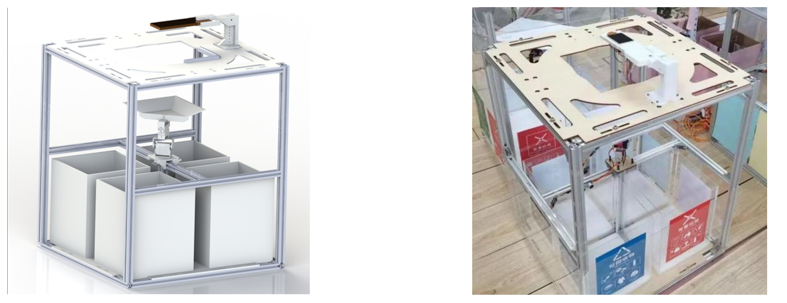
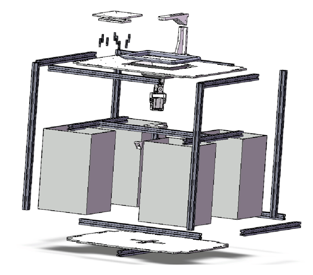
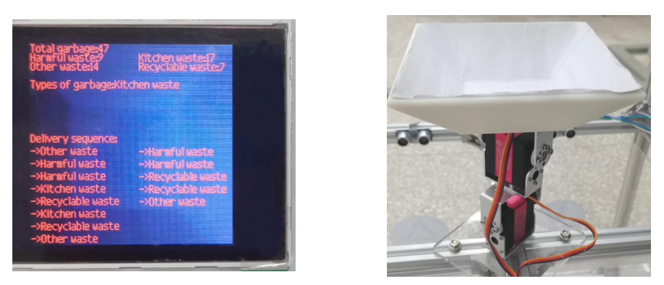
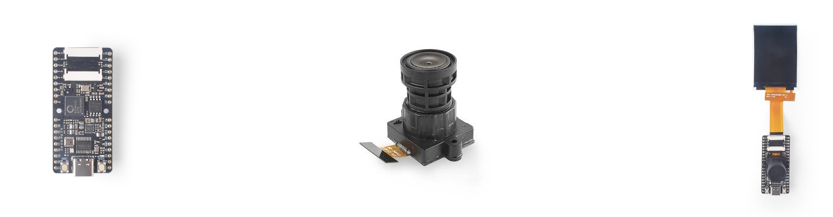
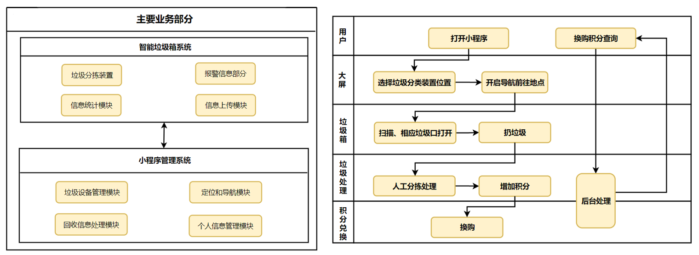
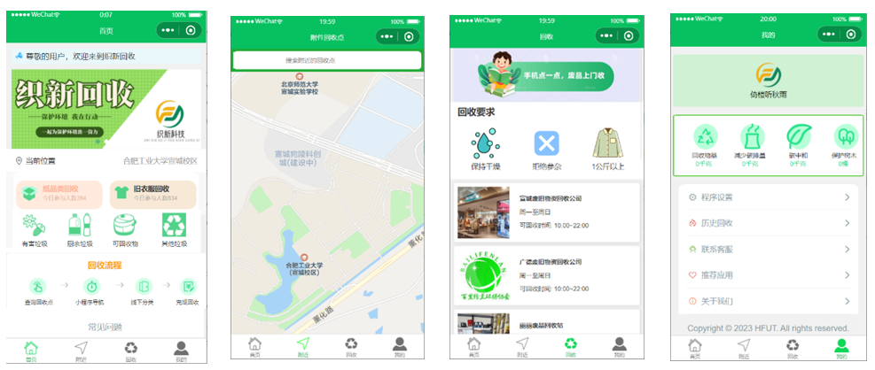
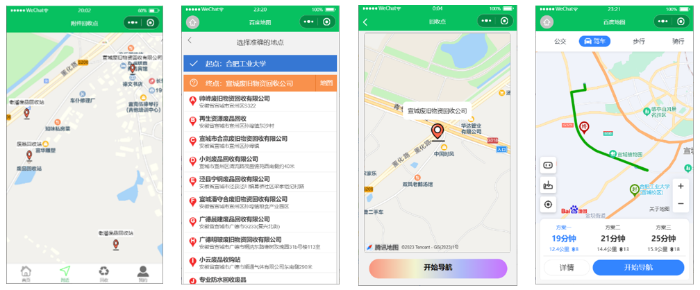
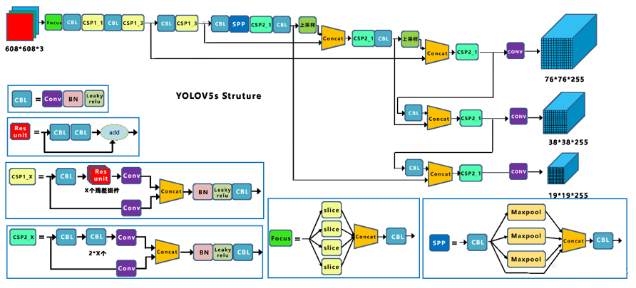
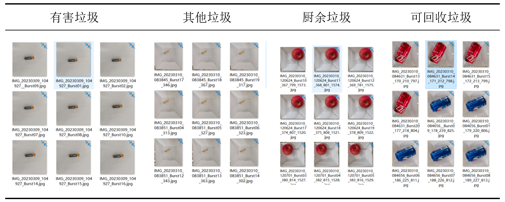
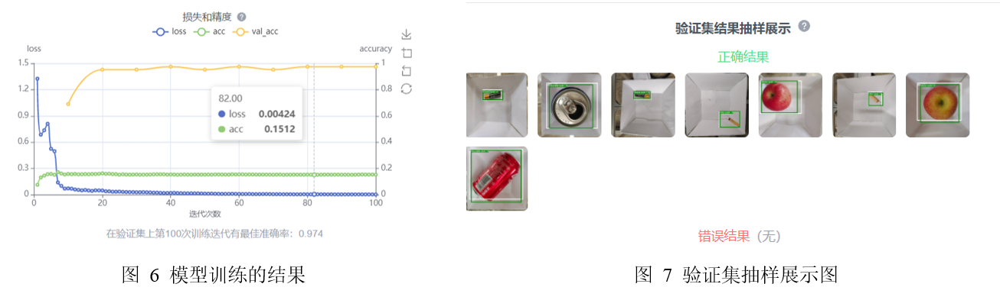

# 基于MaixBit的生活垃圾智能分类系统

## 写在前面

​	此项目是我和小伙伴们为了参加工训大赛和节能减排大赛所完成的一个小项目, 项目内容并不复杂, 但是从有想法到最终实现也算是感觉小有成就。

​	项目的实现效果可详见此repo的演示视频文件, 并且实物图纸和代码均已上传。

## 设计方案

### 系统设计

​      智能垃圾分类装置主体由四部分组成。框架结构由铝制型材搭建而成，型材之间通过角码和T形螺母连接，结构简单，强度可靠，在垃圾箱这类没有过大载荷和强度要求的场景下经济实用。分类机构采用垂直安置的两个舵机组成双自由度机械臂，与托盘直连，高效实现对识别后的垃圾进行分类。

​        识别摄像头基于Sipeed MaixBit开发板对放置在托盘内的物品进行扫描和识别，实现了对垃圾的精准把控和快速分类。过载警报通过在垃圾桶边缘安置的超声波检测装置，当垃圾高于警戒位置后，蜂鸣器发出警报，实现过载警报。在生活垃圾智能分类装置的顶面安装有一块具有显示功能的高亮显示屏，可以显示垃圾投放数据如投放顺序、垃圾类别、本次投入该类垃圾的数量、任务完成提示、满载情况等进行可视化展示。

​       生活垃圾智能分类装置设计如下图1所示。整体框架搭建采用带有开槽的方形型材可通过不同规格型号尺寸的连接件实现其他功能的扩展。底部可通过方形螺母的连接，实现过载警报等必要电器元件的扩展；垃圾分类箱四角立柱在顶部的连接采用边材截面与立柱垂直截面配合，在高度方向有更好的可控余地，可向上扩展更多功能，实现更好的兼容性。

图 1 系统结构设计图以及实物图

### 机械部分

 		生活垃圾智能分类装置整体由铝制型材搭建而成，铝制型材尺寸规格为20mm * 20mm，整体尺寸长宽为500mm * 500mm，高度视具体情况而定，主要参考因素为分类料斗跟随舵机的移动幅度和干涉情况。底部垃圾桶为四个透明亚克力板搭接而成的立方体，放置在有限位的亚克力底板上，尺寸规格为200mm * 200mm * 300mm，在规则限制的范围内实现最大的垃圾投放容量。

​		分类装置顶端同样由亚克力材质组成，中间有200mm * 200mm的正方形开口，实现垃圾投放。开口上方为视觉识别摄像头的安装立架，通过立架的开槽实现线路安置。开口正下方为垃圾分类料斗，由PLA材料3D打印制成，中心开有沉头通孔，方便料斗与舵机之间的连接，料斗由两个270°舵机实现四个方向的倾角控制。

图 2 智能垃圾分类装置机械结构设计图

#### 分类装置

​		在框架搭建过程中，我们借助侧梁引出型材穿过分类装置的正中间，借助型材连接的角码标准件，配合亚克力板切割而成的舵机安装板，减少十字对接结构的材料浪费情况。分类装置由两个舵机组成，上下舵机沿转动轴垂直安装，安装与横梁呈45°夹角，实现对按四角分布的垃圾箱的准确投掷。舵机顶部连接有垃圾分类料斗，选用15kg的舵机以实现舵机之间的直连，简化机构的同时满足功能实现的可靠性。

#### 显示装置

​		在分类装置的上方需配有一块高亮显示屏,支持各种格式的视频和图片播放,并显示该装置内部的各种数据:投放顺序、垃圾类别名称、数量、任务完成提示、满载情况等，如下图3所示。系统将根据超声波检测垃圾是否超出限定的容量，当垃圾投放超出容量限制后蜂鸣器发出报警满载提醒，同时显示屏显示相关信息。

图 3 智能垃圾分类显示和投放装置

#### 识别系统

​		在200mm*200mm的开口上方由3D打印立支架实现面包板、识别摄像头、显示屏等物件的安置，通过简单的设计改变安置高度，让摄像头识别范围控制在料斗之内，减少不必要物件的干扰，提高识别精度。采用下图4所示的Maix Bit开发板、摄像头和智能显示屏来捕捉垃圾的图片，将训练好的模型烧录至开发板中对图像进行识别并分类，输出结果来控制机械臂进行投放。

图 4 智能垃圾分类识别系统

​		软件方面使用MaixPy IDE编程平台可以在电脑上实时编辑脚本并上传到开发板，并直接在开发板上执行脚本；同时电脑上也可以实时查看摄像头图像、保存文件到开发板。在训练模型时使用MaixHub进行图像检测在线训练。

### 软件部分

​		本系统的软件结构的业务框架和业务流程图如下图5所示。本系统主要由智能垃圾箱系统和小程序管理系统2个主要部分组成。小程序管理系统则是软件的主体部分,该部分提供整体功能服务、对整个系统起到整体调度、统一的资源安排等功能，提供统一的功能接口。

​		流程图描述了小程序所实现的主要功能的业务流程。将垃圾扔到垃圾桶之前,用户可以根据小程序导航定位去往指定的垃圾回收点,然后打开对应的垃圾分类设备,并自行投放。进入到分拣流程，管理人员可以根据实际情况为用户增加相应的兑换积分。用户也可以通过小程序实现账户管理、交易查询、商品兑换、积分提现等功能。

图 5 : 软件业务框架和业务流程图

​		如下图所示为产品主页展示, 在软件开发部分中, 我们在微信小程序中基于uni-app、vant-wapp组件、百度地图API, 以及微信云开发技术设计了四个主界面, 分别是“首页”、“附近”、“回收”、“我的”界面。

图 6: 小程序主页面显示

​		具体来说, 在“首页”部分展示了我们的回收理念和回收步骤, 并附上了一些对于本小程序的常见问题介绍; 在“附近”界面, 我们利用腾讯地图展示了当前地图位置信息, 用户可通过搜索框搜索附近的回收点; 在“回收”界面, 我们挪列了一些回收点以及信息, 可以通过点击相应回收点进入到预约界面; 在“我的”界面, 是本小程序一些其他功能的展示, 包括对历史回收记录的查看, 对程序功能的设置, 联系客服来反馈问题等等。

​		如下图4个子图所示为, 我们在设置垃圾投放回收点后为用户进行导航的功能展示, 用户可以搜寻目标回收点, 然后根据小程序的功能展示导航到指定的位置。

图 7 小程序导航功能展示

## 工作原理

### YOLOv5介绍

​		YOLOv5 是一种单阶段目标检测算法，YOLOv5 相比 YOLOv4 而言，在检测平均精度降低不多的基础上，具有均值权重文件小，训练时间和推理速度短的特点。YOLOv5 的网络结构分为输入端、Backbone、Neck、Head 四个部分, 其整体的网络结构图如 8所示

图 8：YOLOv5s整体的网络结构图

1. 输入端：主要包括 Mosaic 数据增强、图片尺寸处理以及自适应锚框计算三部分。Mosaic数据增强将四张图片进行组合，达到丰富图片背景的效果；图片尺寸处理对不同长宽的原始图像自适应的添加最少的黑边，统一缩放为标准尺寸；

2. Backbone：主要包含了 BottleneckCSP和 Focus 模块。BottleneckCSP 模块在增强整个卷积神经网络学习性能的同时大幅减少了计算量；Focus 模块对图片进行切片操作，将输入通道扩充为原来的 4 倍，并经过一次卷积得到下采样特征图，在实现下采样的同时减少了计算量并提升了速度，具体操作如下图7所示。
3.  Neck：采用了 FPN 与 PAN 结合的结构，将常规的 FPN 层与自底向上的特征金字塔进行结合，同时将主干层与检测层进行特征融合，使模型获取更加丰富的特征信息。
4. Head 输出一个向量，该向量具有目标对象的类别概率、对象得分和该对象边界框的位置。检测网络由三层检测层组成，不同尺寸的特征图用于检测不同尺寸的目标对象。

### 模型训练

​		作品采用K210开发板配合YOLOv5框架进行图像检测识别。k210的模型训练可以在Maixhub 上进行，准备好需要训练的数据集，上传训练数据训练模型。这里使用了上千张四种生活垃圾的照片作为数据集，下表为可回收垃圾、厨余垃圾、有害垃圾和其他垃圾四种生活垃圾的部分数据集。

表 1 部分生活垃圾数据集

​		在训练模型之前需先对四种垃圾进行贴标签处理，以人工贴标签的方式将四种分别垃圾标注为Harmful waste、Kitchen waste、Recyclable waste和Other waste。为了使系统可以识别不同摆放姿势、不同类型的生活垃圾，模型训练参数采用随机镜像、随机模糊和允许负样本设置。下图是YOLOv5神经网络训练模型训练的结果，在验证集上第100次训练迭代有最佳准确率**:0.974**。在验证集结果抽样展示中，识别结果和标签一致，说明模型训练效果较好。

### 性能分析

​		之后进行实机测试，作品具体功能实现操作:首先将待识别的垃圾放在正上方盘子上。智能摄像头识别装置对垃圾进行图像识别，确定垃圾的种类。生活垃圾智能识别装置判断的垃圾类型确定垃圾投放口倾斜的方向，机械臂旋转一定的角度，将垃圾投入相应的垃圾桶。装置顶面的高亮显示屏显示投放顺序、垃圾类别、本次投入该类垃圾的数量、任务完成提示等数据。识别装置判断是否有垃圾桶已满。若有则满载报警，装置顶面的高亮显示屏显示满载，若没有，则继续下一个垃圾的投放。

​		经实验计算不同类别垃圾识别准确率见表 2。受摄像头畸变的影响， 出现了个别垃圾名称识别错误的情况，但仍能投放至正确的大类中。同时，由于其它垃圾种类过于繁多，对异形的碎瓷片出现了无法识别的现象。

表 2 ：不同类别垃圾识别准确率

| 项目     | 厨余垃圾 | 可回收垃圾 | 有害垃圾 | 其他垃圾 |
| -------- | -------- | ---------- | -------- | -------- |
| 测试结果 | 195/200  | 192/200    | 194/200  | 191/200  |
| 识别率   | 97.5%    | 96%        | 97%      | 95.5%    |

## 参考文献

[1]  张琳琳, 王伟, 张亮. 基于智能算法的垃圾分类方法综述[J]. 计算机应用, 2021, 41(10): 2797-2803.

[2]  郝琴, 陈春霞, 韩志军. 垃圾分类智能识别技术的研究现状与展望[J]. 电子技术应用, 2021, 47(6): 83-89.

[3]  陈娟, 张倩, 王亚茹. 垃圾分类与可回收物回收利用的发展现状及对策[J]. 中国资源综合利用, 2021, 39(4): 16-20.

## 一些可能有用的链接

1. [MaixPy 文档简介 - Sipeed Wiki](https://wiki.sipeed.com/soft/maixpy/zh/)
2. [GPIO · MaixPy 文档 (86x.org)](http://www.86x.org/cn-maixpy/cn.maixpy.sipeed.com/dev/zh/api_reference/Maix/gpio.html)
3. [MaixHub](https://maixhub.com/)
4. [K210 上手（避坑）指南 - Sipeed Wiki](https://wiki.sipeed.com/news/MaixPy/K210_usage.html?highlight=避坑)

